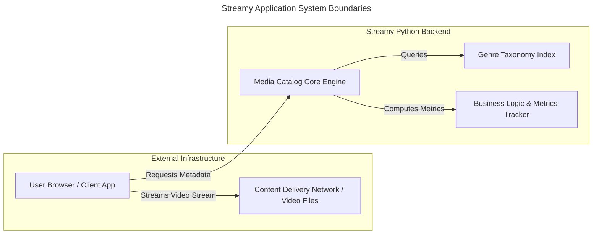

# Streamy Video Streaming Backend Platform
## Project Inception and Structural System Abstract

### 1. Architectural Core Objectives
Streamy is an object-oriented backend media management catalog designed to serve as
the core engine for an enterprise digital video streaming marketplace. The application
tracks, structures, and processes the relationships between underlying media formats,
classification taxonomies, and user metric collections.

### 2. Primary System Boundaries
The diagram below maps out the explicit boundary conditions separating internal Python
engine logic from external architectural infrastructure:

### 3. Core Structural Domain Entities
The baseline software codebase architecture relies explicitly on the following
foundational structural components:

1. **Title:** The central media class encapsulating core metadata properties (such as
distinct name values and release timestamps) for both discrete feature films and
episodic series on the platform.

2. **Genre:** The master classification category module (e.g., Sci-Fi, Drama,
Documentary) mapping the taxonomy layer of the application.
